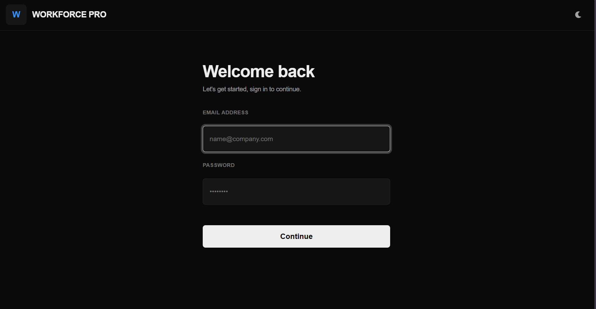
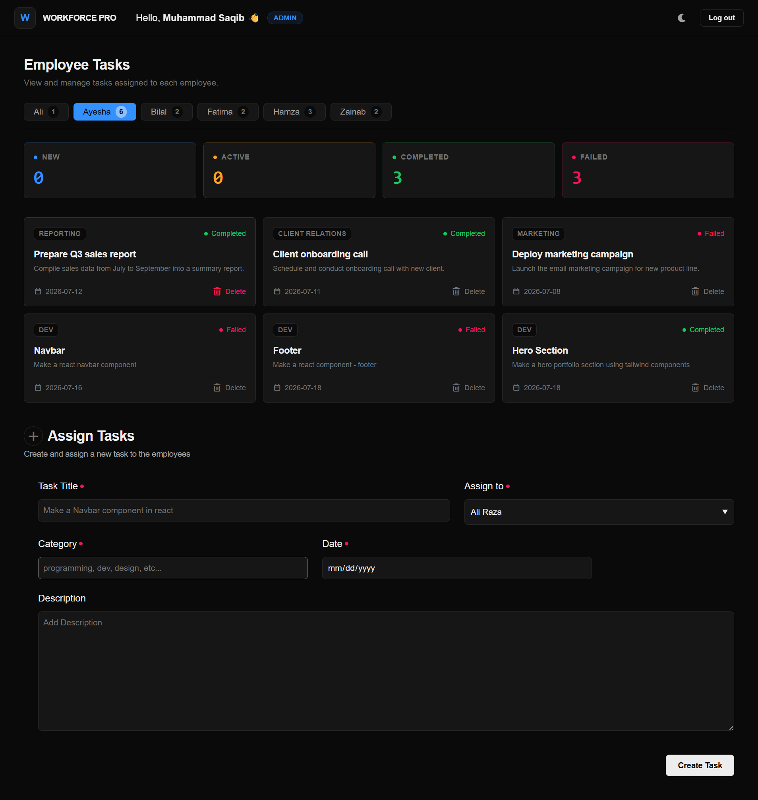
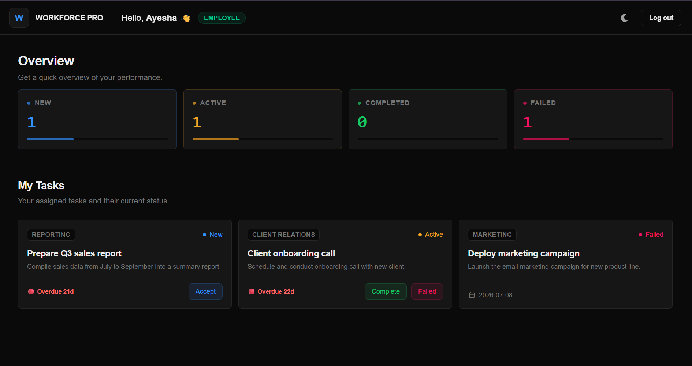
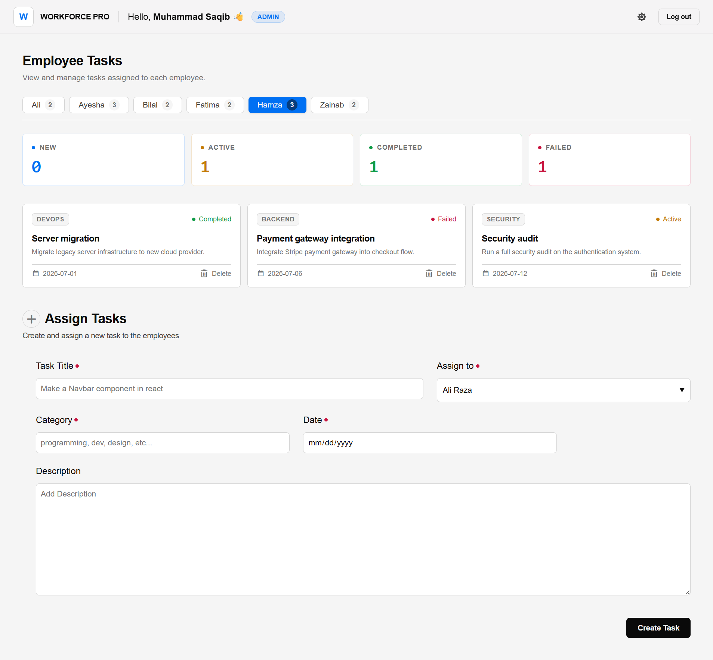

<div align="center">

# Employee Management System (EMS)

A role-based task management platform where admins assign work and employees track it through its full lifecycle, built with React 19, Vite, and Tailwind CSS v4.

[](https://react.dev)
[](https://vitejs.dev)
[](https://tailwindcss.com)
[](LICENSE)

[Live Demo](https://workforce-pro-elite.vercel.app/) · [Report Bug](https://github.com/Saqib216/employee-management-system/issues) · [Request Feature](https://github.com/Saqib216/employee-management-system/issues)

</div>

---

## Table of Contents

- [Overview](#overview)
- [Live Demo](#live-demo)
- [Screenshots](#screenshots)
- [Key Features](#key-features)
- [Tech Stack](#tech-stack)
- [Architecture & Design Decisions](#architecture--design-decisions)
- [Project Structure](#project-structure)
- [Getting Started](#getting-started)
- [Demo Credentials](#demo-credentials)
- [User Flows](#user-flows)
- [Known Limitations](#known-limitations)
- [Roadmap](#roadmap)
- [What I Learned](#what-i-learned)
- [Contributing](#contributing)
- [License](#license)
- [Contact](#contact)

---

## Overview

EMS is a front-end task management system that simulates how an organization assigns and tracks work between an admin and a team of employees. An admin creates tasks and assigns them to specific employees. Each employee has a personal dashboard where incoming tasks move through a defined lifecycle: **New → Accepted → Completed / Failed**.

The project was built in two passes. The first version came out of following a React tutorial to learn the fundamentals. Everything in this repository is a full rebuild on top of that foundation: the component architecture, state management, task lifecycle logic, and UI were redesigned and rewritten independently to fix functional gaps and bring the project to a portfolio-ready standard.

There is no backend. All application state (users, tasks, task counts) lives in React Context and is persisted to the browser's localStorage, so the app remains usable after a refresh without needing a server.

## Live Demo

**[View Live Demo](https://workforce-pro-elite.vercel.app/)**

## Screenshots

### 1. Login Screen


### 2. Admin Dashboard


### 3. Employee Dashboard


### 4. Light Theme Mode



## Key Features

**Authentication & Roles**
- Email/password login that checks credentials against seeded user data
- Two distinct roles (Admin, Employee), each routed to a purpose-built dashboard
- Session persistence across refreshes via localStorage, so a logged-in user stays logged in

**Admin Dashboard**
- Create a task with title, description, due date, and category
- Assign a task directly to an employee
- Real-time overview table showing every employee's task counts (new, active, completed, failed) at a glance

**Employee Dashboard**
- Personal task board showing only tasks assigned to that employee
- Summary cards showing live counts per status
- Full task lifecycle control: accept a new task, then mark it completed or failed
- Task cards display title, description, category, and due date

**Data & State**
- Centralized state via React Context, shared between admin and employee views
- Any status change made by an employee is immediately reflected in the admin's overview table
- All data persists in localStorage, no data loss on refresh

**UI/UX**
- Custom dark theme built on Tailwind CSS v4's `@theme` tokens (not default Tailwind colors)
- Consistent, reusable button component with variant-based styling (primary, secondary, danger, ghost)
- Smooth hover/active state transitions throughout

## Tech Stack

| Category | Technology |
|---|---|
| Library | React 19 (functional components, hooks) |
| Build Tool | Vite 8 |
| Styling | Tailwind CSS v4 |
| State Management | React Context API |
| Persistence | Browser localStorage |
| Linting | ESLint |
| Deployment | Vercel |

## Architecture & Design Decisions

**Why Context API instead of Redux or Zustand?**
The app has a single shared piece of state (the list of employees and their tasks) consumed by a handful of components. Context API covers this cleanly without pulling in a state management library the project doesn't need at this scale.

**Why localStorage instead of a backend?**
This project's purpose was to prove out front-end architecture and interaction design end-to-end. Adding a backend was intentionally deferred so the focus could stay on component structure, state flow, and UI, without infrastructure concerns diluting the scope. The data layer is isolated in `utils/LocalStorage.jsx` and the app reads and writes through it, so swapping localStorage for a real API later is a contained change rather than a rewrite.

**Component design**
Task cards for every status (new, accepted, completed, failed) share the same layout and only differ in the action buttons available and the status label. Instead of four separate near-duplicate components, they're built as a single `TaskCard` component driven by a status configuration object, the same variant pattern used in the `Button` component. One place to change the design, one place to add a new status.

## Project Structure

```
src/
├── assets/                     # Images and static assets
├── components/
│   ├── Auth/
│   │   └── SignIn.jsx           # Login form
│   ├── Dashboard/
│   │   ├── AdminDashboard.jsx    # Admin view: create + overview
│   │   └── EmployeeDashboard.jsx  # Employee view: task board
│   ├── TaskList/
│   │   ├── TaskList.jsx           # Renders tasks by status
│   │   └── TaskCard.jsx            # Shared card for all task statuses
│   └── other/
│       ├── Header.jsx               # Top bar with user greeting + logout
│       ├── Button.jsx                # Reusable variant-based button
│       ├── CreateTask.jsx             # Admin task creation form
│       └── AllTasks.jsx                # Admin team overview table
├── context/
│   └── AuthProvider.jsx          # Global state: auth + employee/task data
├── utils/
│   └── LocalStorage.jsx           # Seed data + localStorage read/write helpers
├── App.jsx                         # Auth routing (login vs dashboards)
└── main.jsx                         # App entry point
```

## Getting Started

### Prerequisites
- Node.js 18 or higher
- npm

### Installation

```bash
git clone https://github.com/Saqib216/employee-management-system.git
cd employee-management-system
npm install
```

### Run locally

```bash
npm run dev
```

The app will be available at `http://localhost:5173`.

### Build for production

```bash
npm run build
```

## Demo Credentials

The app seeds demo accounts into localStorage on first load. Use these to log in:

**Admin**
```
Email:    admin@ems.com
Password: Admin@123
```

**Employee**
```
Email:    ali.raza@ems.com
Password: Ali@1234
```

## User Flows

**Admin flow**
1. Log in with admin credentials
2. Fill out the task creation form (title, description, date, category)
3. Select the employee to assign the task to
4. Submit, the task appears instantly in that employee's dashboard
5. Track team-wide progress from the overview table

**Employee flow**
1. Log in with employee credentials
2. View assigned tasks grouped by status
3. Accept a new task to move it into "active"
4. Mark an active task as completed or failed once the work is done
5. Status counters update immediately across the dashboard

## Known Limitations

Being upfront about the current scope, since this is a front-end learning project rather than a production system:

- No real backend, so data is scoped to a single browser and isn't shared across devices
- Authentication is a client-side credential check, not a secure auth system, and isn't suitable for real user data
- Employee list is seeded, not editable through the UI yet
- No automated tests

## Roadmap

- [ ] Connect to a real backend (Firebase or a Node/Express + database API)
- [ ] Add React Router for URL-based navigation between views
- [ ] Admin: add, remove, and edit employees from the UI
- [ ] Task editing and deletion
- [ ] Replace browser `alert()` calls with proper toast notifications
- [ ] Add unit tests for task lifecycle logic

## What I Learned

Rebuilding this project independently, after the initial tutorial version, is where most of the actual learning happened. A few takeaways worth mentioning:

- **Component duplication is a design smell, not just extra code.** Four nearly identical task card components made every future change four times harder. Refactoring them into one configurable component was a bigger improvement to the codebase than any single feature.
- **State that's shared across unrelated views needs a clear owner.** Moving task and user data into a single Context provider, instead of passing it down through props, kept the admin and employee dashboards in sync automatically.
- **"Looks done" and "works" are different bars.** Buttons that are styled correctly but have no click handler pass a visual review and fail a functional one. Testing every interactive element by hand, not just glancing at the UI, caught real bugs before deployment.

## Contributing

This is a personal learning project, but suggestions are welcome. Feel free to open an issue or submit a pull request.

## License

Distributed under the MIT License. See `LICENSE` for details.

## Contact

**Saqib**
GitHub: [@Saqib216](https://github.com/Saqib216)

Project Link: [https://github.com/Saqib216/employee-management-system](https://github.com/Saqib216/employee-management-system)